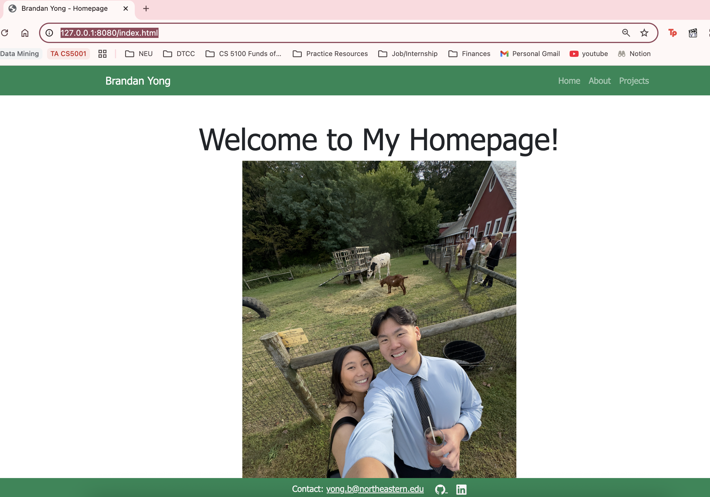

# Brandan Yong's Personal Homepage

## Author

Brandan Yong

## Class Link

CS 5610 Web Development - Northeastern University
https://johnguerra.co/classes/webDevelopment_fall_2025/

## Project Objective

Create a professional personal homepage showcasing my background, skills, and projects using modern web development technologies including ES6 modules, responsive design, and interactive JavaScript functionality.

## Screenshot



## Project Structure

```
personal-homepage/
├── css/
│   └── styles.css
├── docs/
│   ├── design-document.md
│   └── generate_projects_page.md
├── images/
│   ├── codechunk_generated.jpeg
│   ├── homepage_preview.jpeg
│   ├── homepage.jpeg
│   └── wireframes.svg
├── js/
│   └── main.js
├── pages/
│   ├── about.html
│   └── projects.html
├── .eslintrc.js
├── .prettierrc
├── index.html
├── LICENSE
├── package.json
└── README.md
```

## Instructions to Build

1. Clone the repository
2. Install dependencies: `npm install`
3. Start local server: `npm start`
4. Open browser to `http://localhost:8080`
5. To format code: `npm run format`
6. To lint code: `npm run lint`


## Link to Deployed Homepage

https://byong821.github.io/personal-homepage/