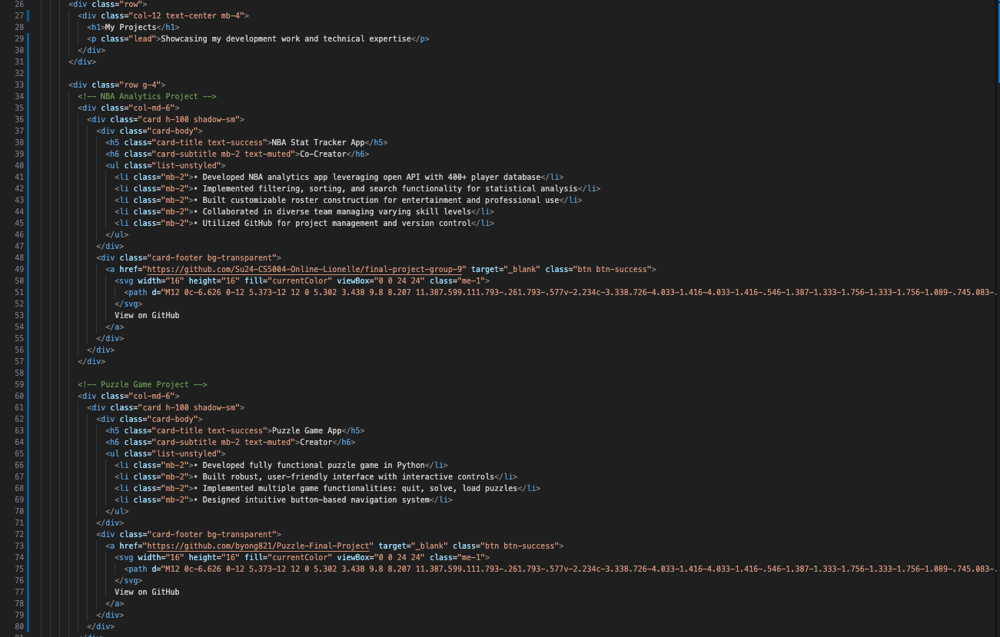

<strong>Amazon Q</strong>

<strong>Did you know?</strong>

MCP is available in Amazon Q!

Select code & ask me to explain, debug or optimize it, or type `/` for quick actions

---

@workspace pretend you&#39;re a web developer creating a subpage for my projects in my personal web page that recruiters, developers, and colleagues will use. given these links to my repositories on github, and the descriptions i have for them, implement my **@projects.html** to be engaging and professional:

nba analytics github repository link:
https://github.com/Su24-CS5004-Online-Lionelle/final-project-group-9

puzzle project github repository link:
https://github.com/byong821/Puzzle-Final-Project

NBA Stat Tracker App Co-Creator
●
Developed an NBA analytics app that leverages an open API to create a comprehensive database of over
400+ current players, enabling users to filter, sort, and search by various statistics, and construct
customizable rosters for both entertainment and professional analytical purposes.
●
Collaborated effectively in a diverse team, managing varying skill levels and synthesizing multiple
perspectives to produce a cohesive and well-designed final product.
●
Utilized GitHub for project management, handling merge requests, resolving conflicts, and maintaining
code integrity through structured version control practices.
Puzzle Game App Creator
●
Developed a fully functional puzzle game in Python with a robust, user-friendly interface featuring
multiple interactive buttons for game control, including quit, solve, and load new puzzle functionalities

---

To add your workspace as context, enable local indexing in your IDE settings. After enabling, add @workspace to your question, and I'll generate a response using your workspace as context.

---

I'll replace the placeholder content in your projects.html with professional project cards showcasing your NBA analytics and puzzle game projects.

---

Replacing the placeholder projects content with professional project cards for the NBA analytics and puzzle game projects

---

I've transformed your projects page into a professional showcase with two project cards that highlight your NBA analytics and puzzle game applications. The design features:

- Clean card layout with consistent styling matching your site's green theme
- Bullet-pointed achievements for easy scanning by recruiters
- GitHub links with icons for direct repository access
- Responsive design that works on desktop and mobile
- Professional language emphasizing technical skills and collaboration

The layout presents your projects in an engaging, scannable format that effectively communicates your development capabilities to potential employers and colleagues.

## Implementation Screenshot

The above screenshot shows the implemented projects page with professional project cards for both the NBA analytics and puzzle game applications.
